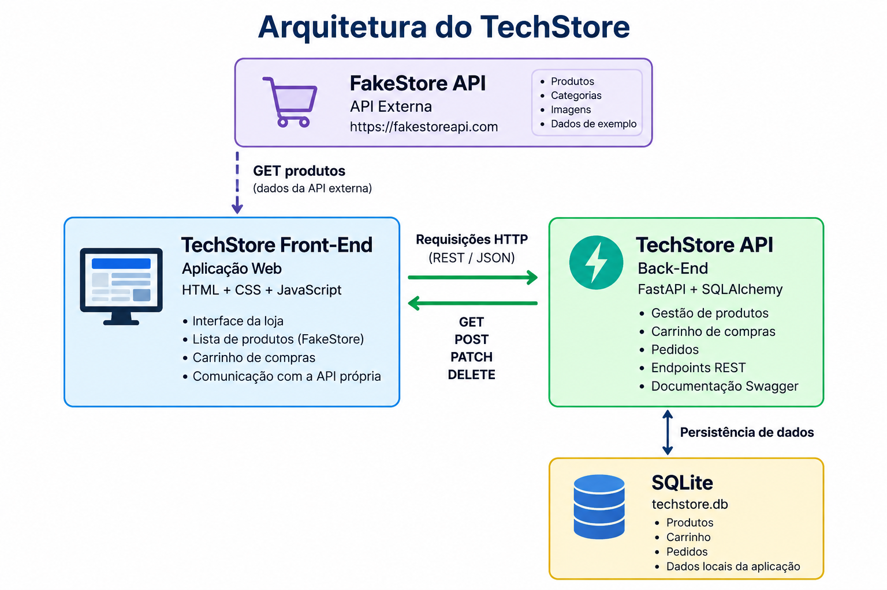

# TechStore API

API Back-End desenvolvida para o projeto académico TechStore.

A API é responsável pela gestão dos pedidos realizados no sistema, permitindo criar, consultar, atualizar e eliminar pedidos.

## Tecnologias utilizadas

- Python
- FastAPI
- SQLAlchemy
- SQLite
- Uvicorn
- Docker

## Estrutura do projeto

```text
loja-tech-API/
├── main.py
├── database.py
├── models.py
├── requirements.txt
├── Dockerfile
├── README.md
└── techstore.db
```

## Arquitetura do sistema

O sistema TechStore é composto por três módulos principais:

- Front-End desenvolvido com HTML, CSS e JavaScript.
- Back-End desenvolvido com FastAPI e SQLAlchemy.
- API externa FakeStore utilizada para obtenção dos produtos.

Os pedidos realizados pelo utilizador são armazenados numa base de dados SQLite.



## Funcionalidades

A API permite:

- Criar pedidos
- Listar pedidos
- Consultar um pedido pelo ID
- Atualizar o estado de um pedido
- Eliminar pedidos
- Armazenar os pedidos numa base de dados SQLite
- Tratar pedidos inexistentes através do código HTTP 404

## Endpoints

| Método | Endpoint | Descrição |
|---|---|---|
| GET | `/` | Verifica se a API está a funcionar |
| GET | `/status` | Consulta o estado da API |
| GET | `/pedidos` | Lista todos os pedidos |
| POST | `/pedidos` | Cria um novo pedido |
| GET | `/pedidos/{pedido_id}` | Consulta um pedido pelo ID |
| PATCH | `/pedidos/{pedido_id}` | Atualiza o estado de um pedido |
| DELETE | `/pedidos/{pedido_id}` | Elimina um pedido |

## Executar localmente

### 1. Clonar o repositório

```bash
git clone https://github.com/luisartursiquara/loja-tech-api
cd loja-tech-API.git
```

### 2. Instalar as dependências

```bash
pip install -r requirements.txt
```

### 3. Iniciar a API

```bash
python -m uvicorn main:app --reload
```

A API ficará disponível em:

`http://127.0.0.1:8000`

## Documentação Swagger

Com a API em execução, a documentação interativa pode ser consultada em:

`http://127.0.0.1:8000/docs`

Através do Swagger é possível testar os endpoints da API.

## Executar com Docker

Construir a imagem:

```bash
docker build -t loja-tech-api .
```

Executar o container:

```bash
docker run --name techstore-api -p 8000:8000 loja-tech-api
```

Depois, a documentação Swagger estará disponível em:

`http://127.0.0.1:8000/docs`

## Base de dados

O projeto utiliza SQLite através do SQLAlchemy.

Os pedidos são armazenados na base de dados:

`techstore.db`

Cada pedido possui:

- ID
- Total
- Estado

O estado inicial de um novo pedido é `pendente` e pode posteriormente ser atualizado, por exemplo, para `pago`.

## Integração

Esta API é utilizada pelo Front-End da TechStore.

O sistema completo é composto por:

```text
FakeStore API
      |
      | GET produtos
      v
TechStore Front-End
      |
      | GET / POST / PATCH / DELETE
      v
TechStore API
      |
      v
SQLite
```

O Front-End utiliza também a FakeStore API como serviço externo para obter os produtos apresentados na loja.